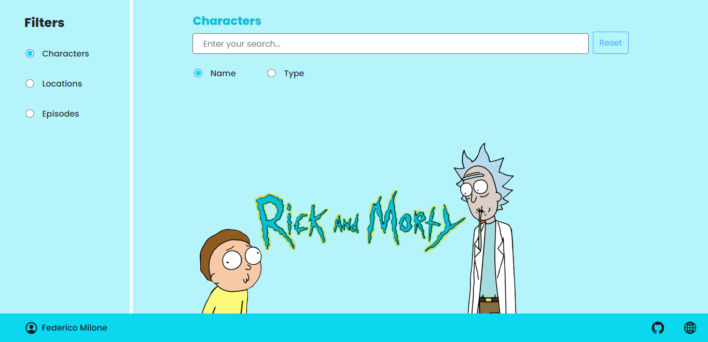

# Rick & Morty Challenge (React)

### App Demo

https://rickmorty-react.vercel.app/

### Stack

- React

- ES6

- Redux

- GraphQL with Apollo Client

- React-Bootstrap

- Sass

- PropTypes

### Starting the application

- git clone https://github.com/fedeemilo/rick-morty-react-challenge.git -> clone repository

- cd rick-morty-react-challenge -> change directory to the project

- npm install or yarn -> install dependencies

- npm start -> run the app

## Screenshots

### App home screen

### Search process

### Select character modal

### Select location modal

### Select episode modal

